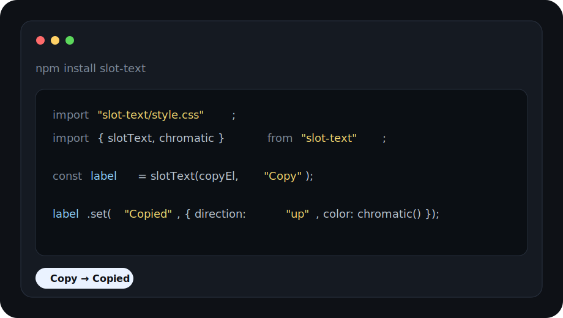

# slot-text

Dependency-free text roll animation for tiny, tactile UI labels.



## Install

```bash
npm install slot-text
```

## Use

### Vanilla

```ts
import "slot-text/style.css";
import { slotText, chromatic } from "slot-text";

const label = slotText(document.querySelector("#copy")!, "Copy");

label.set("Copied", {
  direction: "up",
  color: chromatic(),
});
```

### React

```tsx
import "slot-text/style.css";
import { SlotText } from "slot-text/react";
import { chromatic } from "slot-text";

export function CopyLabel({ copied }: { copied: boolean }) {
  return (
    <SlotText
      text={copied ? "Copied" : "Copy"}
      options={{
        direction: copied ? "up" : "down",
        skipUnchanged: false,
        color: copied ? chromatic() : undefined,
      }}
    />
  );
}
```

### Vue

```vue
<script setup lang="ts">
import "slot-text/style.css";
import { SlotText } from "slot-text/vue";
import { chromatic } from "slot-text";

const options = {
  direction: "up",
  skipUnchanged: false,
  color: chromatic(),
} as const;
</script>

<template>
  <SlotText text="Copied" :options="options" />
</template>
```

## API

Vanilla controller:

```ts
const label = slotText(element, "Copy", options);

label.set("Copied");
label.set("Copy", { direction: "down" });
label.destroy();
```

Framework components:

```ts
import { SlotText as ReactSlotText } from "slot-text/react";
import { SlotText as VueSlotText } from "slot-text/vue";
```

Low-level helpers:

```ts
import {
  buildSlotText,
  animateSlotText,
  chromatic,
} from "slot-text";
```

## Options

```ts
type SlotOptions = {
  direction?: "up" | "down";
  stagger?: number;
  duration?: number;
  exitOffset?: number;
  easing?: string;
  bounce?: number;
  color?: string | ((index: number, total: number) => string);
  colorFade?: number;
  skipUnchanged?: boolean;
};
```

Defaults are tuned for a soft, springy roll:

```ts
{
  direction: "down",
  stagger: 45,
  duration: 300,
  exitOffset: 50,
  easing: "cubic-bezier(0.34, 1.56, 0.64, 1)",
  bounce: 0.6,
  colorFade: 280,
  skipUnchanged: true,
}
```

## Example

```html
<button>
  <span id="copy-label"></span>
</button>

<script type="module">
  import "slot-text/style.css";
  import { slotText } from "slot-text";

  const label = slotText(document.querySelector("#copy-label"), "Copy");

  document.querySelector("button").addEventListener("click", () => {
    label.set("Copied", { direction: "up", skipUnchanged: false });
    window.setTimeout(() => label.set("Copy"), 1400);
  });
</script>
```

## Font support

Each character animates inside its own measured cell, sized with the exact
font you give the element — so widths are always correct.

Works great with:

- **Monospace fonts** — perfect fit, every cell is identical.
- **Proportional Latin / Cyrillic / Greek fonts** (Geist, Inter, SF, …) —
  including italics and glyphs with overhang.

Known tradeoffs (inherent to any per-character slot animation):

- **Kerning is lost.** Each glyph is its own box, so pairs like `AV` or `To`
  sit slightly looser than in plain text. Invisible at UI label sizes,
  noticeable at large display sizes with kerning-heavy fonts.
- **Ligatures won't form** — `fi`, `fl`, or coding ligatures stay separate.
- **Joined scripts are unsupported.** Arabic, Devanagari and other shaping
  scripts need contextual letterforms across the string and will render as
  isolated forms.
- **Complex emoji split.** Single emoji are fine (surrogate pairs are
  handled), but ZWJ sequences (👨‍👩‍👧) and combining marks break into
  multiple cells.
- **Very tall display/script fonts** may clip at the vertical roll mask,
  which is sized to `line-height: 1.3`.

In short: ideal for short Latin labels, numbers, statuses and commands — in
essentially any font you'd use for those.

## Notes

- Browser-only DOM utility.
- Core API has no runtime dependencies.
- React and Vue are optional peer dependencies. Plain JS users do not need them.
- Works best on short labels, buttons, counters, and command text.
- Import the CSS once before using the animation.
